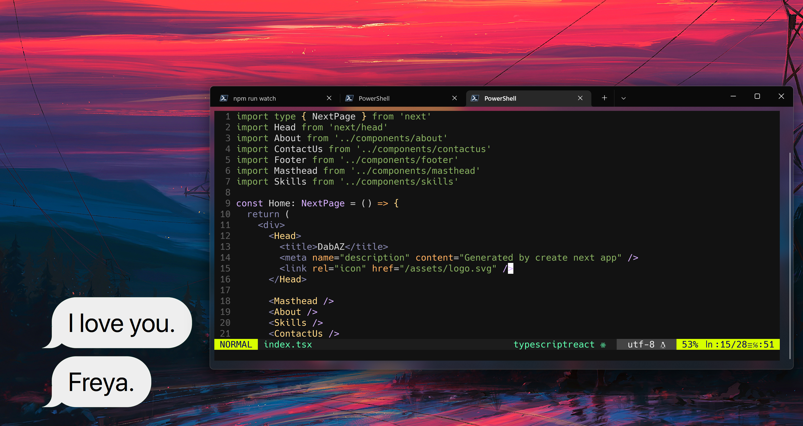

# DabAZ's dotfiles

This is **my** personal dotfiles. You can design yours based on mine and please use at your own risk.

## Contents
- vim (NeoVim) config (Plugins are managed with [vim-plug](https://github.com/junegunn/vim-plug))
- Powershell config

## Want to work with me?

You can send me an [E-mail](mailto:hi@dabaz.me).

You can also contact me via 
- [Instagram](https://www.instagram.com/dabaz_official/)
- [Twitter](https://twitter.com/dabaz_official/)
- [LinkedIn](https://www.linkedin.com/in/diebold-dai/)
- [Personal Website](https://dabaz.me)
